# SQL Data Mover Module

A PowerShell module for automating database migration operations between different SQL Server platforms, with support for Azure SQL Database (PaaS), Azure SQL Managed Instance, and Azure SQL IaaS VMs.

## Overview

The SQL Data Mover module provides comprehensive functionality for:
- Exporting databases to BACPAC or BAK files
- Uploading backup files to Azure Storage
- Downloading backup files from Azure Storage
- Importing databases from backup files
- Supporting multiple Azure SQL deployment types

## Architecture


## Supported Deployment Types

| Deployment Type | Export Format | Import Format | Notes                      |
| --------------- | ------------- | ------------- | -------------------------- |
| **AzurePaaS**   | BACPAC        | BACPAC        | Azure SQL Database         |
| **AzureMI**     | BACPAC/BAK    | BACPAC/BAK    | Azure SQL Managed Instance |
| **AzureIaaS**   | BACPAC/BAK    | BACPAC/BAK    | SQL Server on Azure VMs    |

## Workflow Diagrams

### Export Operation Flow

```mermaid
flowchart TD
    START([Start Export Operation]) --> VALIDATE{Validate Prerequisites}
    VALIDATE -->|Pass| CHECK_TYPE{Check Deployment Type}
    VALIDATE -->|Fail| ERROR_END([❌ End with Error])
    
    CHECK_TYPE -->|AzurePaaS| EXPORT_BACPAC[Export to BACPAC]
    CHECK_TYPE -->|AzureMI| CHOOSE_FORMAT{Choose Export Format}
    CHECK_TYPE -->|AzureIaaS| EXPORT_BAK[Export to BAK]
    
    CHOOSE_FORMAT -->|BACPAC| EXPORT_BACPAC
    CHOOSE_FORMAT -->|BAK| EXPORT_BAK
    
    EXPORT_BACPAC --> UPLOAD_STORAGE[Upload to Azure Storage]
    EXPORT_BAK --> UPLOAD_STORAGE
    
    UPLOAD_STORAGE --> CLEANUP{Remove Temp Files?}
    CLEANUP -->|Yes| REMOVE_LOCAL[Remove Local Files]
    CLEANUP -->|No| KEEP_LOCAL[Keep Local Files]
    
    REMOVE_LOCAL --> SUCCESS_END([✅ Export Complete])
    KEEP_LOCAL --> SUCCESS_END
```



### Import Operation Flow


### Memory-Optimized Objects Handling

```mermaid
flowchart TD
    START([BAK File with Memory-Optimized Objects]) --> CHECK_TARGET{Target MI Tier}
    CHECK_TARGET -->|General Purpose| NEED_CLEANUP[Requires Cleanup]
    CHECK_TARGET -->|Business Critical| DIRECT_RESTORE[Direct Restore]
    
    NEED_CLEANUP --> HAS_INTERMEDIATE{Intermediate Server Available?}
    HAS_INTERMEDIATE -->|Yes| RESTORE_TEMP[Restore to Intermediate]
    HAS_INTERMEDIATE -->|No| UPGRADE_TIER[Consider Upgrading MI Tier]
    
    RESTORE_TEMP --> CLEANUP_OBJECTS[Remove Memory-Optimized Objects]
    CLEANUP_OBJECTS --> CREATE_CLEAN_BAK[Create Clean BAK File]
    CREATE_CLEAN_BAK --> RESTORE_FINAL[Restore to Target MI]
    CREATE_CLEAN_BAK --> DROP_TEMP[Drop Temporary Database]
    
    DIRECT_RESTORE --> SUCCESS([✅ Restore Complete])
    RESTORE_FINAL --> SUCCESS
    UPGRADE_TIER --> SUCCESS
```



## Module Structure

### Core Functions

#### Helper Functions
- `Upload-BacpacToStorage` - Uploads BACPAC files to Azure Storage
- `Upload-BakToStorage` - Uploads BAK files to Azure Storage
- `Download-BackupFromStorage` - Downloads backup files from Azure Storage
- `Find-LatestBackupBlob` - Finds the most recent backup file in storage
- `Write-StatusMessage` - Provides formatted console output with colors and emojis
- `Initialize-Logging` - Sets up logging infrastructure
- `Write-LogMessage` - Writes messages to log files

#### Export Functions
- `Export-SqlDatabaseToBacpac` - Exports database to BACPAC using SqlPackage
- `Export-SqlDatabaseToBak` - Exports database to BAK using SQL BACKUP command
- `Export-DatabaseOperation` - Main export orchestration function

#### Import Functions
- `Import-BacpacToSqlDatabase` - Imports BACPAC using SqlPackage
- `Import-BakToSqlDatabase` - Imports BAK using SQL RESTORE command
- `Import-DatabaseOperation` - Main import orchestration function

#### Utility Functions
- `Test-Prerequisites` - Validates required tools and access
- `Test-RequiredFields` - Validates CSV configuration
- `Test-DiskSpace` - Checks available disk space
- `Test-SqlServerAccess` - Tests database connectivity
- `Test-StorageAccess` - Tests Azure Storage connectivity
- `Get-ServerFQDN` - Constructs proper Azure SQL FQDNs

## CSV Configuration

### Required Fields

| Field                | Description                         | Example              |
| -------------------- | ----------------------------------- | -------------------- |
| `Operation_ID`       | Unique identifier for the operation | `001`, `002`         |
| `Database_Name`      | Name of the database                | `WideWorldImporters` |
| `Storage_Account`    | Azure Storage account name          | `mystorageaccount`   |
| `Storage_Container`  | Storage container name              | `backups`            |
| `Storage_Access_Key` | Storage account access key          | `base64key...`       |

### Export-Specific Fields

| Field                    | Description                 | Example                |
| ------------------------ | --------------------------- | ---------------------- |
| `SRC_server`             | Source server name          | `sql-server-01`        |
| `SRC_SQL_Admin`          | Source SQL admin username   | `sqladmin`             |
| `SRC_SQL_Password`       | Source SQL admin password   | `P@ssw0rd123`          |
| `Local_Backup_File_Path` | Local path for backup files | `C:\Backups\db.bacpac` |

### Import-Specific Fields

| Field              | Description                    | Example       |
| ------------------ | ------------------------------ | ------------- |
| `DST_server`       | Destination server name        | `sql-mi-01`   |
| `DST_SQL_Admin`    | Destination SQL admin username | `sqladmin`    |
| `DST_SQL_Password` | Destination SQL admin password | `P@ssw0rd123` |

### Optional Fields

| Field                | Description                         | Default     | Example                |
| -------------------- | ----------------------------------- | ----------- | ---------------------- |
| `Type`               | Deployment type                     | `AzurePaaS` | `AzureMI`, `AzureIaaS` |
| `Remove_Tempfile`    | Clean up local files                | `true`      | `false`                |
| `IntermediateServer` | Server for memory-optimized cleanup | -           | `sql-vm-temp`          |
| `DataFileLocation`   | Custom data file location           | -           | `C:\Data\`             |
| `LogFileLocation`    | Custom log file location            | -           | `C:\Logs\`             |

### Example CSV

```csv
Operation_ID,Database_Name,Type,SRC_server,SRC_SQL_Admin,SRC_SQL_Password,DST_server,DST_SQL_Admin,DST_SQL_Password,Storage_Account,Storage_Container,Storage_Access_Key,Local_Backup_File_Path,Remove_Tempfile
001,WideWorldImporters,AzureMI,sql-source.database.windows.net,sqladmin,P@ssw0rd123,sql-mi-target.database.windows.net,sqladmin,P@ssw0rd456,mystorageaccount,backups,base64key...,C:\Temp\WideWorldImporters.bak,true
002,AdventureWorks,AzurePaaS,sql-onprem,sqladmin,P@ssw0rd123,sql-paas-target.database.windows.net,sqladmin,P@ssw0rd456,mystorageaccount,backups,base64key...,C:\Temp\AdventureWorks.bacpac,false
```

## Usage Examples

### Basic Export Operation

```powershell
# Import the module
Import-Module .\SQLMove.psm1

# Read CSV configuration
$csvData = Import-Csv -Path "migration-config.csv"

# Process each row for export
foreach ($row in $csvData) {
    $logFile = Initialize-OperationLogging -OperationId $row.Operation_ID -DatabaseName $row.Database_Name -StartTime (Get-Date) -LogsFolder "C:\Logs"
    
    $success = Export-DatabaseOperation -Row $row -SqlPackagePath "C:\Program Files\Microsoft SQL Server\150\DAC\bin\SqlPackage.exe" -LogFile $logFile
    
    if ($success) {
        Write-Host "✅ Export completed for $($row.Database_Name)" -ForegroundColor Green
    } else {
        Write-Host "❌ Export failed for $($row.Database_Name)" -ForegroundColor Red
    }
}
```

### Basic Import Operation

```powershell
# Import the module
Import-Module .\SQLMove.psm1

# Read CSV configuration
$csvData = Import-Csv -Path "migration-config.csv"

# Process each row for import
foreach ($row in $csvData) {
    $logFile = Initialize-OperationLogging -OperationId $row.Operation_ID -DatabaseName $row.Database_Name -StartTime (Get-Date) -LogsFolder "C:\Logs"
    
    $success = Import-DatabaseOperation -Row $row -SqlPackagePath "C:\Program Files\Microsoft SQL Server\150\DAC\bin\SqlPackage.exe" -LogFile $logFile
    
    if ($success) {
        Write-Host "✅ Import completed for $($row.Database_Name)" -ForegroundColor Green
    } else {
        Write-Host "❌ Import failed for $($row.Database_Name)" -ForegroundColor Red
    }
}
```

## Prerequisites

### Software Requirements
- **PowerShell 5.1** or later
- **Azure PowerShell Module** (`Az.Storage`)
- **SqlPackage.exe** (from SQL Server Data Tools)
- **SQL Server Management Objects** (for SQL operations)

### Installation Commands

```powershell
# Install Azure PowerShell module
Install-Module -Name Az -Scope CurrentUser -Repository PSGallery -Force

# Install specific storage module
Install-Module -Name Az.Storage -Scope CurrentUser -Force

# Verify SqlPackage.exe location
Get-Command SqlPackage.exe -ErrorAction SilentlyContinue
```

### Permissions Required
- **Source Database**: `db_datareader`, `db_datawriter`, `db_ddladmin`
- **Destination Database**: `db_owner` or equivalent
- **Azure Storage**: Read/Write access to storage account
- **Local System**: Write access to temporary directories

## Logging and Monitoring

### Log File Structure

```
C:\Logs\
├── session_20250627_132000.log          # Session-level log
├── 001_WideWorldImporters_20250627_132000.log  # Operation-specific log
└── 002_AdventureWorks_20250627_133000.log      # Operation-specific log
```

### Log Message Types
- **📋 Header** - Section headers and major milestones
- **🔄 Action** - Active operations in progress
- **ℹ️ Info** - Informational messages
- **✅ Success** - Successful operations
- **⚠️ Warning** - Non-critical issues
- **❌ Error** - Critical errors

### Sample Log Output

```
2025-06-27 13:20:00 [Action] Starting BACPAC export from 'WideWorldImporters' on 'sql-source.database.windows.net'...
2025-06-27 13:20:01 [Info] SqlPackage arguments: /Action:Export /SourceServerName:sql-source.database.windows.net...
2025-06-27 13:25:30 [Success] Export completed successfully in 00:05:30
2025-06-27 13:25:30 [Success] BACPAC file size: 245.67 MB
2025-06-27 13:25:31 [Action] Uploading BACPAC to storage...
2025-06-27 13:27:45 [Success] Upload completed successfully
```

## Troubleshooting

### Common Issues

#### 1. Memory-Optimized Objects Error
```
Error: Memory-optimized filegroup must be empty in order to be restored on General Purpose tier
```
**Solutions:**
- Upgrade target to Business Critical tier
- Use intermediate server for cleanup
- Add `IntermediateServer` column to CSV

#### 2. Storage Access Denied
```
Error: Cannot open backup device. Operating system error 5(Access is denied.)
```
**Solutions:**
- Verify SAS token generation
- Check storage account permissions
- Ensure credential name matches container URL

#### 3. SqlPackage Not Found
Error: sqlpackage.exe not found at path
```
**Solutions:**
- Install SQL Server Data Tools (SSDT)
- Update `SqlPackagePath` parameter
- Verify PATH environment variable

#### 4. Connection Timeout
```
Error: Connection timeout expired
```
**Solutions:**
- Check firewall rules
- Verify server FQDN format
- Increase connection timeout values
- Test connectivity with `Test-SqlServerAccess`

#### 5. Insufficient Disk Space
```
Error: There is not enough space on the disk
```
**Solutions:**
- Clean up temporary directories
- Increase disk space
- Use different temporary location
- Enable `Remove_Tempfile` option

### Diagnostic Commands

```powershell
# Test all prerequisites
Test-Prerequisites -SqlPackagePath "C:\Program Files\Microsoft SQL Server\150\DAC\bin\SqlPackage.exe" -CsvPath "migration-config.csv"

# Test specific server connectivity
Test-SqlServerAccess -ServerFQDN "sql-server.database.windows.net" -DatabaseName "master" -Username "sqladmin" -Password "password" -Operation "Source" -LogFile "test.log"

# Test storage access
Test-StorageAccess -StorageAccount "mystorageaccount" -StorageContainer "backups" -StorageKey "base64key..." -LogFile "test.log"

# Check disk space
Test-DiskSpace -Path "C:\Temp" -RequiredSpaceGB 10 -LogFile "test.log"
```

## Performance Considerations

### File Size Guidelines

| Database Size | Recommended Approach      | Estimated Time |
| ------------- | ------------------------- | -------------- |
| < 1 GB        | Direct BACPAC             | 5-15 minutes   |
| 1-10 GB       | BACPAC with monitoring    | 15-60 minutes  |
| 10-100 GB     | BAK file preferred        | 30-180 minutes |
| > 100 GB      | BAK + parallel processing | 2+ hours       |

### Optimization Tips

1. **Use BAK files for large databases** (faster than BACPAC)
2. **Enable compression** for BAK exports
3. **Use SSD storage** for temporary files
4. **Schedule during off-peak hours**
5. **Monitor network bandwidth** during transfers
6. **Clean up temporary files** to save space

### Parallel Processing Example

```powershell
# Process multiple databases in parallel
$csvData = Import-Csv -Path "migration-config.csv"
$jobs = @()

foreach ($row in $csvData) {
    $job = Start-Job -ScriptBlock {
        param($rowData, $modulePath, $sqlPackagePath)
        
        Import-Module $modulePath
        $logFile = Initialize-OperationLogging -OperationId $rowData.Operation_ID -DatabaseName $rowData.Database_Name -StartTime (Get-Date) -LogsFolder "C:\Logs"
        
        Export-DatabaseOperation -Row $rowData -SqlPackagePath $sqlPackagePath -LogFile $logFile
    } -ArgumentList $row, ".\SQLMove.psm1", "C:\Program Files\Microsoft SQL Server\150\DAC\bin\SqlPackage.exe"
    
    $jobs += $job
}

# Wait for all jobs to complete
$jobs | Wait-Job | Receive-Job
$jobs | Remove-Job
```

## Security Best Practices

### Credential Management
- **Never hardcode passwords** in scripts
- **Use Azure Key Vault** for production environments
- **Rotate storage keys** regularly
- **Use SAS tokens** with minimal permissions and short expiry
- **Encrypt CSV files** containing sensitive data

### Network Security
- **Enable SSL/TLS** for all connections
- **Use private endpoints** where possible
- **Implement firewall rules** for database access
- **Monitor access logs** for suspicious activity

### Example Secure Configuration

```powershell
# Using Azure Key Vault for credentials
$keyVaultName = "my-keyvault"
$srcPassword = (Get-AzKeyVaultSecret -VaultName $keyVaultName -Name "sql-source-password").SecretValueText
$dstPassword = (Get-AzKeyVaultSecret -VaultName $keyVaultName -Name "sql-destination-password").SecretValueText
$storageKey = (Get-AzKeyVaultSecret -VaultName $keyVaultName -Name "storage-account-key").SecretValueText

# Update CSV data with secure credentials
foreach ($row in $csvData) {
    $row.SRC_SQL_Password = $srcPassword
    $row.DST_SQL_Password = $dstPassword
    $row.Storage_Access_Key = $storageKey
}
```

## Advanced Configuration

### Custom File Naming Patterns

The module automatically generates file names with the following pattern:
```
{OperationID}_{DatabaseName}_{Timestamp}.{Extension}
```

Example: `001_WideWorldImporters_20250627_132000.bacpac`

### Environment-Specific Settings

```powershell
# Development environment
$devConfig = @{
    StorageAccount = "devstorageaccount"
    Container = "dev-backups"
    RemoveTempFiles = $false  # Keep files for debugging
    LogLevel = "Verbose"
}

# Production environment
$prodConfig = @{
    StorageAccount = "prodstorageaccount"
    Container = "prod-backups"
    RemoveTempFiles = $true   # Clean up automatically
    LogLevel = "Info"
}
```

### Custom Backup Retention

```powershell
function Remove-OldBackups {
    param(
        [string]$StorageAccount,
        [string]$Container,
        [string]$StorageKey,
        [int]$RetentionDays = 30
    )
    
    $context = New-AzStorageContext -StorageAccountName $StorageAccount -StorageAccountKey $StorageKey
    $cutoffDate = (Get-Date).AddDays(-$RetentionDays)
    
    $oldBlobs = Get-AzStorageBlob -Container $Container -Context $context | 
                Where-Object { $_.LastModified -lt $cutoffDate }
    
    foreach ($blob in $oldBlobs) {
        Remove-AzStorageBlob -Blob $blob.Name -Container $Container -Context $context -Force
        Write-Host "Removed old backup: $($blob.Name)" -ForegroundColor Yellow
    }
}
```

## Integration Examples

### PowerShell Universal Integration

```powershell
# API endpoint for database migration
New-PSUEndpoint -Url "/api/migrate-database" -Method POST -Endpoint {
    param($DatabaseName, $SourceServer, $DestinationServer, $OperationType)
    
    try {
        Import-Module "C:\Scripts\SQLMove.psm1"
        
        # Create temporary CSV row
        $migrationRow = [PSCustomObject]@{
            Operation_ID = (New-Guid).ToString().Substring(0,8)
            Database_Name = $DatabaseName
            Type = "AzureMI"
            SRC_server = $SourceServer
            DST_server = $DestinationServer
            # ... other required fields
        }
        
        $logFile = Initialize-OperationLogging -OperationId $migrationRow.Operation_ID -DatabaseName $DatabaseName -StartTime (Get-Date) -LogsFolder "C:\Logs"
        
        if ($OperationType -eq "Export") {
            $result = Export-DatabaseOperation -Row $migrationRow -SqlPackagePath $SqlPackagePath -LogFile $logFile
        } else {
            $result = Import-DatabaseOperation -Row $migrationRow -SqlPackagePath $SqlPackagePath -LogFile $logFile
        }
        
        return @{
            Success = $result
            OperationId = $migrationRow.Operation_ID
            LogFile = $logFile
        }
    }
    catch {
        return @{
            Success = $false
            Error = $_.Exception.Message
        }
    }
}
```

### Azure DevOps Pipeline Integration

```yaml
# azure-pipelines.yml
trigger:
- main

pool:
  vmImage: 'windows-latest'

variables:
  sqlPackagePath: 'C:\Program Files\Microsoft SQL Server\150\DAC\bin\SqlPackage.exe'

steps:
- task: PowerShell@2
  displayName: 'Database Migration'
  inputs:
    targetType: 'inline'
    script: |
      Import-Module "$(System.DefaultWorkingDirectory)\SQLMove.psm1"
      
      $csvData = Import-Csv -Path "$(System.DefaultWorkingDirectory)\migration-config.csv"
      
      foreach ($row in $csvData) {
          $logFile = Initialize-OperationLogging -OperationId $row.Operation_ID -DatabaseName $row.Database_Name -StartTime (Get-Date) -LogsFolder "$(Agent.TempDirectory)\Logs"
          
          $success = Export-DatabaseOperation -Row $row -SqlPackagePath "$(sqlPackagePath)" -LogFile $logFile
          
          if (-not $success) {
              Write-Error "Migration failed for $($row.Database_Name)"
              exit 1
          }
      }
```

## Version History

| Version | Date       | Changes                                                |
| ------- | ---------- | ------------------------------------------------------ |
| 1.0.0   | 2025-06-27 | Initial release with basic export/import functionality |
| 1.1.0   | TBD        | Added memory-optimized object handling                 |
| 1.2.0   | TBD        | Enhanced error handling and logging                    |
| 1.3.0   | TBD        | Added parallel processing support                      |

## Contributing

### Development Setup

1. Clone the repository
2. Install required PowerShell modules
3. Set up test environment with sample databases
4. Run unit tests before submitting changes

### Testing

```powershell
# Run basic functionality tests
Pester -Path ".\Tests\SQLMove.Tests.ps1"

# Test with sample data
$testRow = Import-Csv -Path ".\Tests\test-config.csv" | Select-Object -First 1
Test-RequiredFields -Row $testRow -ExportAction $true -ImportAction $false
```

## Support

### Documentation
- [Azure SQL Documentation](https://docs.microsoft.com/en-us/azure/azure-sql/)
- [SqlPackage Documentation](https://docs.microsoft.com/en-us/sql/tools/sqlpackage)
- [PowerShell Az Module](https://docs.microsoft.com/en-us/powershell/azure/)

### Common Support Scenarios

1. **Migration Planning**: Use the module to assess migration complexity
2. **Bulk Migrations**: Process multiple databases using CSV configuration
3. **Disaster Recovery**: Automate backup and restore procedures
4. **Environment Promotion**: Move databases between dev/test/prod environments

### Contact Information

For issues, feature requests, or contributions:
- Create issues in the project repository
- Follow the contributing guidelines
- Include detailed error logs and configuration details

---

*Last updated: June 27, 2025*
*Module version: 1.0.0*
```

This comprehensive README provides:

1. **Visual Architecture** - Mermaid diagrams showing the overall flow
2. **Detailed Workflows** - Step-by-step process flows for export/import operations
3. **Configuration Guide** - Complete CSV field documentation with examples
4. **Usage Examples** - Practical code samples for common scenarios
5. **Troubleshooting** - Common issues and their solutions
6. **Performance Guidelines** - Optimization tips and best practices
7. **Security Considerations** - Best practices for credential management
8. **Integration Examples** - How to use with PowerShell Universal and Azure DevOps
9. **Advanced Features** - Custom configurations and parallel processing

The diagrams help visualize the complex workflows, making it easier for users to understand how the module handles different scenarios, especially the memory-optimized objects cleanup process.
